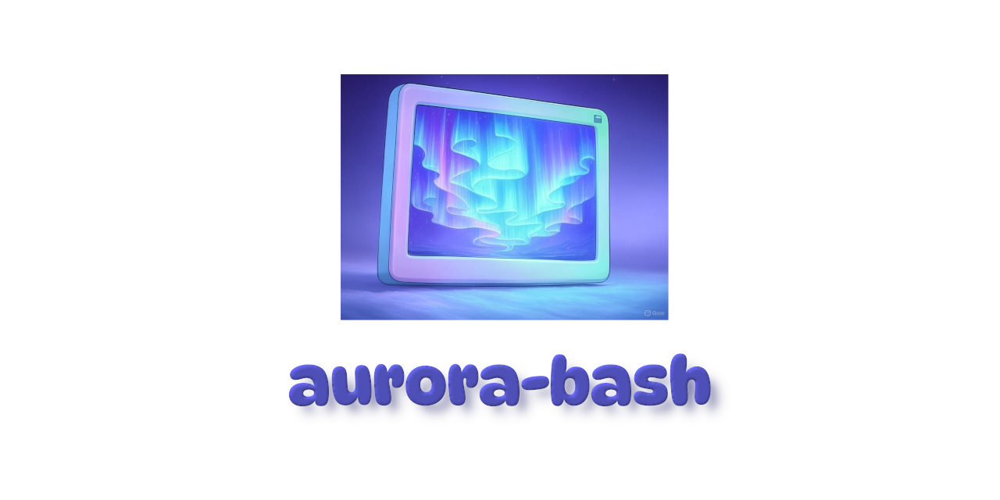

# aurora-bash

_Utility scripts for Bash_



**aurora-bash** is a gallery of scripts for the **Bash** shell - designed to be _simple_ and _reusable_.

## Installation

The recommended way to retrieve aurora-bash is a Git checkout - in particular:

```bash
git clone https://github.com/giancosta86/aurora-bash.git
```

As a consequence, you can run `git switch` to choose a specific release; alternatively, you can manually download and unpack the zip file containing the project files for a [specific release](https://github.com/giancosta86/aurora-bash/releases).

No matter the retrieval process, it is recommended to **export** the `AURORA_BASH_HOME` variable, referencing the directory where the project resides: the setup instructions for each script will mention such variable.

It is important to note that scripts are not designed to be detached from the project directory - which should be kept intact because of _inter-script dependencies_.

## ⚙️Flow control

- [strict-mode](scripts/strict-mode/README.md)

- [crash](scripts/crash/README.md)

## 💬Output

- [auroraDebug](scripts/auroraDebug/README.md)

- [header](scripts/header/README.md)

## 📁File system

- [mkcd](scripts/mkcd/README.md)

## 📦NodeJS

- [nvmcd](scripts/nvmcd/README.md)

## Credits

The image within the logo was generated by [Grok](https://x.com/i/grok).
